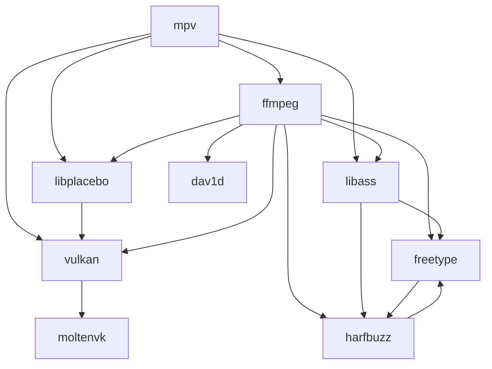

# mpv-build-macOS

A set of scripts that help build [mpv](https://mpv.io) with [MoltenVK](https://github.com/KhronosGroup/MoltenVK) support.

### Requirements

-  [Xcode.app](https://developer.apple.com/xcode/)
-  [Homebrew](https://brew.sh)

### Usage

1. Make sure Xcode is ready by running:

   ```sh
   xcodebuild -runFirstLaunch
   ```

2. Clone the repository:

   ```sh
   git clone "https://github.com/sirlaurie/mpv-build-macOS"
   cd mpv-build-macOS
   ```

3. Run `build`. The first run builds all components; later runs rebuild changed components and their dependents. Use `--prefix` to set the install path (default: `~/.local`) and `--with-bundle` to build `mpv.app`.

   ```sh
   ./build
   ```

   or

   ```sh
   ./build --prefix ~/.local
   ```

   or

   ```sh
   ./build --prefix ~/.local --with-bundle
   ```

   Add `--rebuild` to rebuild all components, keeping your `--prefix` and `--with-bundle` options:

   ```sh
   ./build --prefix ~/.local --with-bundle --rebuild
   ```

4. Add `<prefix>/bin` to your `$PATH`.

### Configuration

```cfg
# ~/.config/mpv/mpv.conf

vo=gpu-next
gpu-context=macvk
```

### Environment variables

-  `MTL_HUD_ENABLED=1`
   Enables the [Metal Performance HUD](https://developer.apple.com/documentation/xcode/monitoring-your-metal-apps-graphics-performance).

-  `MVK_CONFIG_LOG_LEVEL=3`
   Enables verbose MoltenVK logging.

### Dependency graph


